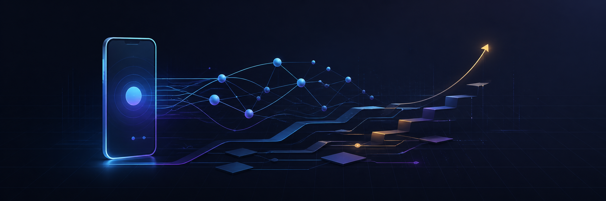

<p align="center">
  
</p>

<h1 align="center">Hi, I'm beBetterEveryday 👋</h1>

<p align="center">
  <strong>AI Full-Stack Engineer · Mobile Specialist</strong><br />
  从产品需求到 AI 工作流、前后端、移动端与交付上线，构建完整而可靠的软件系统。
</p>

<p align="center">
  
  
  
  
  
</p>

## About me

我是一名拥有 **10+ 年软件开发经验**的 AI 全栈工程师。职业起点是 Java 后端，长期深耕 iOS 与 Android 原生开发，随后扩展到 Web、服务端、数据库、小程序和跨端技术；现在更关注如何把 AI Agent 融入真实的软件交付流程。

移动端是我经验最深的领域，但不是能力边界。我能够从需求分析与技术方案开始，完成数据建模、接口、Web 管理端、移动端、小程序、测试验证和上线交付，并持续优化性能、体验与工程效率。

> 用全栈视角解决问题，用移动端标准打磨体验，用 AI 提升整个交付系统。

## Core strengths

| | 能力 | 实践重点 |
| --- | --- | --- |
| 🤖 | **AI-native engineering** | 将 Codex、Claude Code、OpenCode 等 Agent 用于需求拆解、编码、测试、回归与文档；关注上下文工程、工具编排和可验证输出 |
| 🧩 | **全栈闭环交付** | 从数据库与 API，到 Web、移动端、小程序，再到测试和发布，能够独立完成中小型产品功能的完整闭环 |
| 📱 | **移动端深度经验** | iOS / Android 原生架构、性能优化、组件化、实时通信、硬件交互、复杂 UI 与 App 上架维护 |
| 🌐 | **多端产品工程** | React / Vue / Node.js / PHP 与多端客户端协同，重视一致的交互、清晰的边界和可维护的工程结构 |
| 🛠️ | **工程质量与效率** | 组件复用、自动化测试、视觉回归、可观察性、Local-first 工具和持续交付流程 |

## Experience snapshot

### Recent experience · AI 全栈 / 多端产品交付

- 参与企业数字化业务平台建设，覆盖业务管理、交付协作、数据统计、权限与运营工具等多个系统。
- 负责从需求分析、数据库设计、服务端接口，到 Vue Web、iOS / Android、小程序、测试和上线的端到端交付。
- 开发并维护移动端核心业务流程，持续优化冷启动、资源加载、界面响应和复杂交互体验。
- 建设 Vue 组件与通用交互规范，支撑多个管理模块、官网、内容和营销页面的快速迭代。
- 将 AI Agent 引入日常研发，用于方案推演、跨栈实现、自动化验证、代码审查和知识沉淀。

### Earlier experience · 移动端、实时系统与后端基础

- 独立负责多款 iOS 应用的开发、维护与上架，推进 CocoaPods 组件化和通用 UI 能力沉淀。
- 开发 Android 业务系统与硬件通信能力，处理串口数据和实时状态交互。
- 实现 MQTT 即时通讯、语音与多类型消息、全景内容和 3D 模型等复杂功能。
- 参与小程序 Canvas 动态内容生成，以及 Java 企业级业务系统与服务端模块开发。

## Technology landscape

### AI & Agent Engineering

<p>
  
  
  
  
  
</p>

### Web & Interactive Products

<p>
  
  
  
  
  
</p>

### Mobile & Cross-platform

<p>
  
  
  
  
  
  
</p>

### Backend, Data & Realtime

<p>
  
  
  
  
  
  
  
</p>

### Engineering & Delivery

<p>
  
  
  
  
  
</p>

## How I build

```text
Understand the real problem
        ↓
Design an end-to-end solution
        ↓
Build across the required stack with AI assistance
        ↓
Validate through code, tests, data and real interactions
        ↓
Document, automate and improve the next iteration
```

<p align="center">
  <i>Build useful systems. Verify the details. Keep getting better.</i>
</p>
